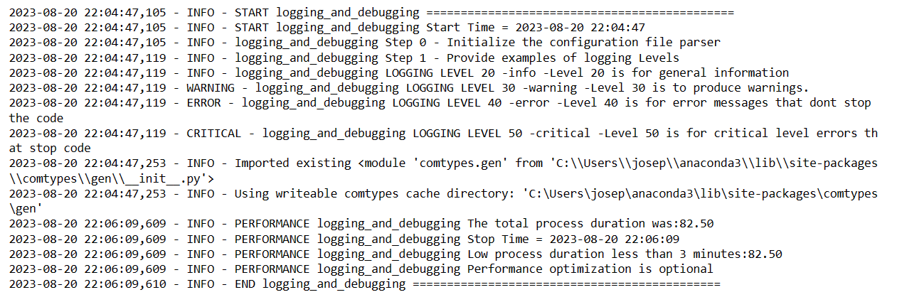

# Logging and Debugging - Quickly and easily track and debug ALL of your code.... ITS EASY !!!!

## Description

Welcome to the **Logging and Debugging** repository! This project demonstrates how to utilize a tlogging and debugging to track your code and debug any issues. 

## Notebook Features

- Self Documenting 
- Self Testing 
- Easily Configurable
- Includes Talking Code 
- Self Logging 
- Self Debugging 

## Features

- Convert code snippets into spoken language.
- Enhance accessibility for visually impaired developers.
- Learn how to integrate a text-to-speech engine into your projects.

## Getting Started

To get started with the **TLogging and Debugging** project, follow these steps:

1. Clone the repository to your local machine.
2. Install the required dependencies listed at the top of the notebook.
3. Explore the example code provided in the repository and experiment.
4. Run the notebook to hear your code come to life!

## Usage

Here's a simple example of how to use the text-to-speech functionality:
 

